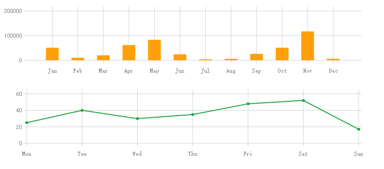

# svgChart

一个图表库，可以输入参数生成svg图表。

### 用法
直接引用文件
```
<link rel="stylesheet" href="../src/chart.css">
<script src="../src/main.js"></script>

<script>
    let barChart = new XChart({
        parent: "#chart1",//必需
        data: bar_data,//必需
        type: 'bar',//必需
        height: 140,
        is_navigable:true
    });
</script>
```

### 参数
参数如下：
```
option{
    parent,//必须，图表父元素
    height,//可选，默认240
    title,//可选，标题
    subtitle,//可选，副标题
    data:{
        "labels": [],//横坐标标签
	    "datasets": [{
			"color": //颜色，可选
			"values": []//数据，length等于labels
		}
	]},//必需，数据
    type,//必需，图表类型：'line','bar'
    is_navigable，//可选，0或1||true或false
}
```
设置is_navigable为true后，点击图表可以触发data-selected事件，事件中的index属性附带点击的数据的index。

### demo

